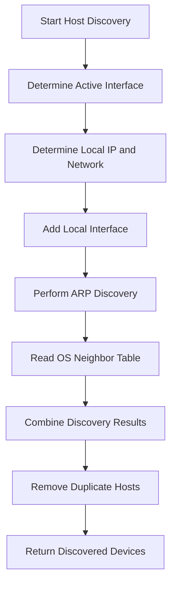
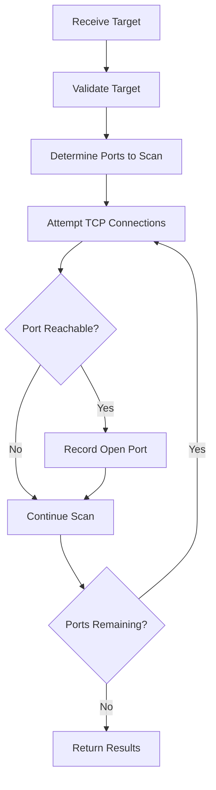
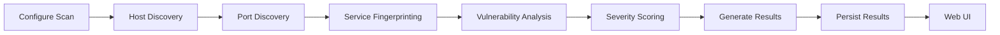

# Vulnerability Scanner

A cross-platform network vulnerability scanner developed for **CPSC 491-10**.

The project is designed to discover devices on a local network, identify exposed network services, analyze those services for potential vulnerabilities, and present the results through an accessible web-based interface.

Development is being completed incrementally. The current implementation focuses primarily on the scanner backend, including **host discovery** and **TCP port scanning**.

> **Important:** This project is intended for educational purposes and for scanning systems and networks that you own or have explicit authorization to test.

---

## Project Overview

The Vulnerability Scanner is intended to provide a modular scanning pipeline capable of:

1. Detecting hosts on a network.
2. Identifying reachable TCP ports.
3. Determining services associated with discovered ports.
4. Matching discovered services against known vulnerabilities.
5. Assigning vulnerability severity information.
6. Generating and storing scan results.
7. Presenting results through a web interface.
8. Supporting both periodic and event-driven scanning.

The scanner is being designed so individual components can be developed and tested independently rather than placing the entire scanning process into a single program.

---

## Current Project Status

### Implemented

* Cross-platform host discovery
* Local interface detection
* Local network/subnet identification
* Local host inclusion in discovery results
* ARP-based device discovery where supported
* Operating-system neighbor table discovery
* Duplicate host result normalization
* TCP port scanning
* Targeted port scanning
* Broader port discovery when ports are not explicitly supplied
* Cross-platform compatibility testing
* Linux support
* Windows support
* macOS support

### In Development / Planned

* Service fingerprinting
* Service/version detection
* Vulnerability matching
* CVE/NVD integration
* CVSS severity scoring
* Scan persistence
* Scan scheduling
* Detection of newly connected devices
* Periodic rescanning
* Reporting
* Web-based user interface
* Remote scanner management
* Deployment packaging

---

## Scanner Architecture

The project separates the scanning process into independent modules.

```text
                 +------------------+
                 |   Scan Request   |
                 +---------+--------+
                           |
                           v
                 +------------------+
                 |  Host Discovery  |
                 +---------+--------+
                           |
                    Discovered Hosts
                           |
                           v
                 +------------------+
                 |   Port Scanner   |
                 +---------+--------+
                           |
                      Open Ports
                           |
                           v
                 +------------------+
                 |     Service      |
                 |  Fingerprinting  |
                 +---------+--------+
                           |
                           v
                 +------------------+
                 | Vulnerability DB |
                 |     Matching     |
                 +---------+--------+
                           |
                           v
                 +------------------+
                 | CVSS / Findings  |
                 +---------+--------+
                           |
                           v
                 +------------------+
                 | Reporting / Data |
                 |   Persistence    |
                 +------------------+
```

Host discovery and port scanning currently form the implemented portion of this pipeline.

---

# Host Discovery

The host discovery module is responsible for identifying devices available on the scanner's local network.

Primary implementation:

```text
scanner_Host_Discovery.py
```

## Discovery Process

The scanner first determines the active network interface and associated network information.

Example:

```text
[*] Interface : wlo1
[*] Local IP  : 10.67.28.133
[*] Gateway   : 10.67.31.254
[*] Interface network : 10.67.16.0/20
[*] Discovery network : 10.67.28.0/24
```

The scanner then gathers hosts using multiple discovery sources.



Using multiple discovery mechanisms helps compensate for differences between operating systems and network environments.

Example output:

```text
IP ADDRESS         MAC ADDRESS          SOURCE
-----------------------------------------------------------------
10.67.28.133       local                local_interface
10.67.31.254       78:24:59:2c:d6:99    arp_scan+neighbor_table

Discovered 2 device(s).
```

### Discovery Sources

Results may originate from sources such as:

| Source            | Description                                                   |
| ----------------- | ------------------------------------------------------------- |
| `local_interface` | Scanner's own network interface                               |
| `arp_scan`        | Device detected through ARP discovery                         |
| `neighbor_table`  | Device found in the operating system's network neighbor table |
| Combined sources  | Host discovered through multiple mechanisms                   |

A host detected through multiple methods is combined into a single result rather than being reported multiple times.

---

# Port Scanner

The port scanner analyzes discovered or manually specified hosts for reachable TCP services.

Primary implementation:

```text
scanner_Port_Scanner.py
```

The current scanner focuses on **TCP connections**.



The port scanner can be used independently or receive hosts discovered by the host discovery module.

For example, a temporary local HTTP server can be used to test detection of an open TCP port.

### Linux / macOS

```bash
python3 -m http.server 8000 --bind 0.0.0.0
```

### Windows

```powershell
python -m http.server 8000 --bind 0.0.0.0
```

This creates a TCP service on port `8000` that can be used while testing the scanner.

---

# Scanner Lifecycle

The intended full scanner lifecycle extends beyond simply running one port scan.



The architecture is intended to allow scans to be initiated through several mechanisms.

```text
Manual Scan
     |
     +--------+
              |
Scheduled ----+----> Scanner Pipeline
              |
New Device ---+
Detected
```

This supports the longer-term goal of monitoring a network rather than requiring every scan to be manually initiated.

---

# Repository Structure

The scanner portion of the project currently centers around the following files:

```text
Vulnerability-Scanner/
|
|-- scanner_Host_Discovery.py
|   `-- Network and host discovery
|
|-- scanner_Port_Scanner.py
|   `-- TCP port discovery
|
|-- test_scanner_compatibility.py
|   `-- Cross-platform compatibility testing
|
|-- README.md
|   `-- Project documentation
|
`-- ...
```

Additional modules will be added as the fingerprinting, vulnerability analysis, persistence, API, and web interface portions of the project are implemented.

---

# Requirements

The scanner is written in **Python 3**.

Verify Python is installed before running the project.

### Linux / macOS

```bash
python3 --version
```

### Windows

```powershell
python --version
```

Install project dependencies when a `requirements.txt` file is available:

### Linux / macOS

```bash
python3 -m pip install -r requirements.txt
```

### Windows

```powershell
python -m pip install -r requirements.txt
```

Some discovery techniques may require elevated privileges depending on the operating system and network configuration.

---

# Running the Scanner

## Host Discovery

### Linux / macOS

```bash
python3 scanner_Host_Discovery.py
```

### Windows

```powershell
python scanner_Host_Discovery.py
```

The discovery module determines the active interface, local IP address, gateway, network range, and discovered devices.

---

## Port Scanner

### Linux / macOS

```bash
python3 scanner_Port_Scanner.py
```

### Windows

```powershell
python scanner_Port_Scanner.py
```

Scanner options should be supplied according to the command-line arguments provided by the implementation.

The port scanner can operate against manually specified targets and is designed to eventually consume hosts automatically from the host discovery module.

---

# Cross-Platform Support

Cross-platform compatibility is an important project requirement.

The scanner is being developed and tested for:

| Operating System | Support Goal |
| ---------------- | ------------ |
| Linux            | Supported    |
| Windows          | Supported    |
| macOS            | Supported    |

Different operating systems expose interfaces, routing information, ARP information, and neighbor tables differently. The scanner therefore uses OS-aware discovery logic rather than assuming Linux-specific commands or behavior.

Cross-platform behavior is tested through:

```text
test_scanner_compatibility.py
```

Platform-specific functionality should remain isolated whenever possible so future changes do not break support for another operating system.

---

# Testing

Run the scanner compatibility tests after modifying scanner functionality.

### Linux / macOS

```bash
python3 test_scanner_compatibility.py
```

### Windows

```powershell
python test_scanner_compatibility.py
```

If the project is configured to use `pytest`, the test suite can also be executed using:

```bash
python -m pytest
```

or:

```bash
python3 -m pytest
```

depending on the operating system.

Automated testing through GitHub Actions is also suitable for validating the scanner against Linux, Windows, and macOS environments.

---

# Deployment Direction

The long-term deployment model is centered around a **web-based interface** rather than requiring users to directly interact with individual Python scripts.

The proposed deployment architecture is:

```text
             User Browser
                  |
                  | HTTP / HTTPS
                  v
          +----------------+
          |     Web UI     |
          +-------+--------+
                  |
                  | API
                  v
          +----------------+
          | Scanner Backend|
          +-------+--------+
                  |
        +---------+----------+
        |                    |
        v                    v
 Host Discovery        Port Scanner
        |                    |
        +---------+----------+
                  |
                  v
        Vulnerability Engine
                  |
                  v
             Persistence
```

The web interface will allow an authorized user to remotely:

* Start scans
* Configure scan targets
* View discovered hosts
* View open ports
* Review vulnerability findings
* Review previous scans
* Monitor scanner activity

---

## Docker

Docker may be used as an optional deployment method, particularly when the backend is hosted on a dedicated machine or server.

Docker can provide:

* Consistent dependency management
* Reproducible deployments
* Easier server installation
* Isolation of application components
* Simplified updates

However, Docker is not required for all deployments.

For a scanner operating exclusively on one personal computer, a native application or normal Python installation may be simpler. Containerization becomes more valuable when the web interface and scanner backend are deployed as persistent services.

Network discovery functionality must also be considered carefully when containerizing the scanner because the scanner needs appropriate access to the network being analyzed.

---

# Planned Components

## Service Fingerprinting

After a port is discovered, the scanner will attempt to identify the service associated with that port.

Examples could include:

```text
22/tcp   SSH
80/tcp   HTTP
443/tcp  HTTPS
```

Where possible, version information can then be collected for vulnerability analysis.

---

## Vulnerability Matching

Discovered software and service versions are intended to be compared against known vulnerability information.

The vulnerability analysis layer is planned to use information such as:

* CVE identifiers
* Affected products
* Affected versions
* CVSS scores
* Vulnerability descriptions
* Severity classifications

The exact matching mechanism will be developed independently from network discovery so vulnerability data sources can change without requiring the network scanner to be rewritten.

---

## Persistence

Scan results will eventually be stored so results can be compared over time.

Potential stored information includes:

* Scan timestamp
* Target network
* Discovered hosts
* MAC addresses
* Open ports
* Detected services
* Software versions
* CVE matches
* Severity scores
* Scan status

Persistence will also allow the web interface to display scan history rather than only the most recent scan.

---

## Continuous Monitoring

The final scanner is intended to support more than one-time manual scans.

Potential scan triggers include:

* User-requested scans
* Scheduled scans
* Periodic network scans
* Detection of a newly connected device

A newly discovered device could trigger a focused scan without requiring the scanner to perform a complete network scan every time.

---

# Design Goals

The project follows several core design goals.

### Modular

Host discovery, port scanning, vulnerability analysis, persistence, and the UI should remain independently maintainable.

### Cross-Platform

Core scanner functionality should operate on Linux, Windows, and macOS.

### Testable

Scanner modules should be testable individually without requiring the entire application stack.

### Extensible

Additional discovery mechanisms, vulnerability databases, fingerprinting methods, and scanning techniques should be addable without redesigning the entire scanner.

### Accessible

Users should ultimately interact with the scanner through a web interface instead of needing direct knowledge of Python or command-line tools.

### Secure

The application should restrict scanner control and results to authorized users and should only be used against networks where scanning permission has been granted.

---

# Development Roadmap

```text
Host Discovery          [Implemented]
       |
       v
TCP Port Scanning       [Implemented]
       |
       v
Service Fingerprinting  [Planned]
       |
       v
Vulnerability Matching  [Planned]
       |
       v
CVSS / Severity         [Planned]
       |
       v
Persistence             [Planned]
       |
       v
Backend API             [Planned]
       |
       v
Web Interface           [Planned]
       |
       v
Continuous Monitoring   [Planned]
```

The modular structure allows development on later components without replacing the existing discovery and scanning functionality.

---

# Contributing

When modifying scanner functionality:

1. Maintain compatibility with **Linux, Windows, and macOS**.
2. Avoid OS-specific behavior unless it is isolated behind platform detection.
3. Keep scanner components modular.
4. Run compatibility tests before submitting changes.
5. Document new command-line options and dependencies.
6. Avoid committing credentials, API keys, or environment-specific configuration.
7. Only test network scanning functionality against authorized systems.

---

# Project

**CPSC 491-10 — Senior Project**

Vulnerability Scanner

The project is being developed collaboratively, with scanner, backend, frontend, testing, documentation, persistence, and deployment responsibilities divided across the development team while maintaining integration between each portion of the system.

---

# License

A project license should be added before public distribution.

Until a license is explicitly provided, the presence of the source code in this repository should not be interpreted as granting permission to redistribute or reuse it outside the terms established by the project authors.

