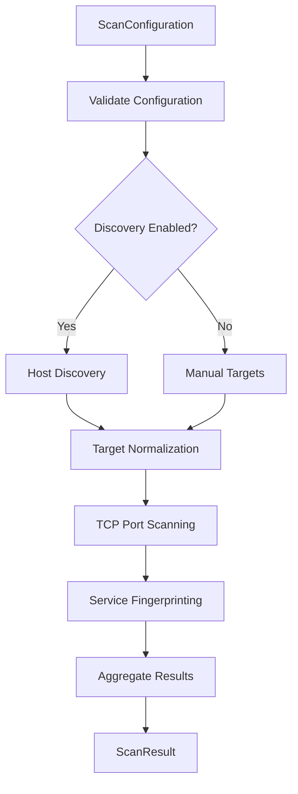
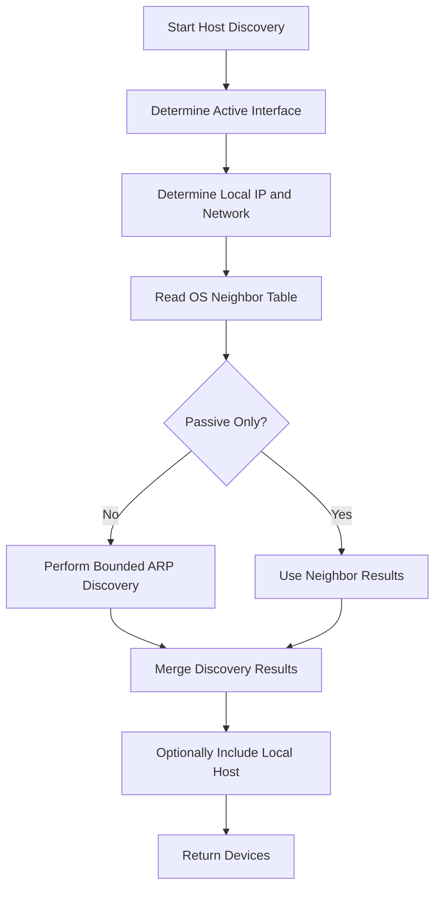
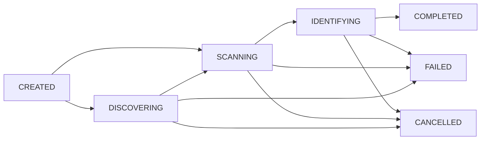

# Vulnerability Scanner

A cross-platform network vulnerability scanner developed for **CPSC 491-10**.

The project is designed to discover devices on an authorized network, identify exposed TCP services, fingerprint discovered services and versions, and provide structured scan data that can be consumed by the backend, persistence layer, and future web interface.

Development is being completed incrementally. The current implementation now includes the Sprint 2 scanner orchestration foundation: shared scanner data contracts, target normalization, coordinated host discovery and TCP scanning, service fingerprinting, lifecycle tracking, progress reporting, cooperative cancellation, structured errors, and aggregated scan results.

> **Important:** This project is intended for educational purposes and for scanning systems and networks that you own or have explicit authorization to test.

---

## Project Overview

The Vulnerability Scanner is designed as a modular scanning pipeline capable of:

1. Accepting and validating scan configuration.
2. Discovering hosts on a local network.
3. Normalizing discovered and manually supplied targets.
4. Identifying reachable TCP ports.
5. Fingerprinting services and software versions.
6. Tracking scan lifecycle and progress.
7. Supporting cooperative scan cancellation.
8. Returning structured scan results and errors.
9. Matching discovered services against known vulnerabilities.
10. Assigning vulnerability severity information.
11. Generating and storing scan results.
12. Presenting results through a web interface.
13. Supporting periodic and event-driven scanning.

The scanner is intentionally split into focused modules so discovery, scanning, fingerprinting, orchestration, persistence, backend, and UI work can evolve independently.

---

## Current Project Status

### Implemented

* Cross-platform host discovery
* Local interface detection
* Local network/subnet identification
* Optional local host inclusion in discovery results
* ARP-based device discovery where supported
* Operating-system neighbor table discovery
* Duplicate host result normalization
* TCP connect port scanning
* Targeted port scanning
* Common, smart, custom, and full-range TCP scan modes
* Adaptive smart port discovery
* Service fingerprinting
* Service and version detection for supported protocols/signatures
* Shared scanner data contracts
* Scan configuration validation
* Host observation normalization
* Port observation normalization
* Manual target support
* IPv4, hostname, and bounded CIDR target normalization
* Scanner coordinator / orchestration layer
* Scan lifecycle state tracking
* Scan progress reporting
* Structured scanner errors
* Structured final/partial scan results
* Cooperative cancellation hooks
* Scanner adapters that preserve existing low-level modules
* Sprint 2 integration tests
* Cross-platform compatibility testing
* Linux support
* Windows support
* macOS support

### In Development / Planned

* Vulnerability matching
* CVE/NVD integration
* CPE normalization
* CVSS severity scoring
* Backend service/API integration
* Scan persistence
* Frontend/backend scan contracts
* Scan scheduling
* Detection of newly connected devices
* Periodic rescanning
* Reporting
* Web-based user interface
* Remote scanner management
* Deployment packaging

---

## Sprint 2 Architecture

Sprint 2 refactors the original standalone scanner modules into a coordinated scanner pipeline without replacing their working core logic.

```text
                    +----------------------+
                    |  ScanConfiguration   |
                    +----------+-----------+
                               |
                               v
                    +----------------------+
                    |  ScannerCoordinator  |
                    +----------+-----------+
                               |
            +------------------+------------------+
            |                  |                  |
            v                  v                  v
   +----------------+  +----------------+  +-------------------+
   | Host Discovery |  |  Port Scanner  |  | Service           |
   | Device output  |  | PortResult     |  | Fingerprinting    |
   +-------+--------+  +-------+--------+  | ServiceFingerprint|
           |                   |           +---------+---------+
           +---------+---------+                     |
                     |                               |
                     v                               |
              +-------------+                        |
              |   Adapters  |<-----------------------+
              +------+------+
                     |
                     v
       +-------------------------------+
       | Shared Scanner Contract Types |
       | HostObservation               |
       | PortObservation               |
       | ScanProgress                  |
       | ScannerError                  |
       | ScanResult                    |
       +---------------+---------------+
                       |
              +--------+--------+
              |                 |
              v                 v
          Backend           Persistence
              |
              v
          Future Web UI
```

The existing discovery, TCP scanning, and fingerprinting modules remain independently usable. The coordinator now provides the application-facing workflow.

---

## Shared Scanner Data Contracts

Primary implementation:

```text
scanner_contracts.py
```

The shared contracts define the data that scanner, backend, persistence, frontend, and future vulnerability-matching components should use.

### `ScanConfiguration`

Represents scan input settings such as:

* Manual targets
* Scan mode
* Port selection
* Timeout
* Discovery enable/disable
* Discovery network
* Local-host inclusion
* Concurrency
* Scan identifier and timestamp

Configuration validation rejects invalid ports, unsupported modes, invalid timeout/concurrency values, and configurations with neither discovery nor manual targets enabled.

### `HostObservation`

Standard representation of a host known to the scanner.

Typical fields include:

* IP address
* Optional hostname
* Optional MAC address
* Discovery source
* Discovery status
* Last-seen timestamp
* Optional metadata

### `PortObservation`

Standard representation of a host/port observation.

Typical fields include:

* Host IP and optional MAC
* Port
* Protocol
* Port state
* Service hint
* Fingerprinted service
* Product
* Version
* Banner
* Confidence
* Observation timestamp

### `ScanLifecycleState`

Current states include:

```text
CREATED
DISCOVERING
SCANNING
IDENTIFYING
MATCHING
COMPLETED
FAILED
CANCELLED
```

`IDENTIFYING` is active when service fingerprinting is performed by the coordinator.

`MATCHING` is reserved for the future vulnerability/CVE matching stage and should not be treated as active until that work is implemented.

### `ScanProgress`

Tracks runtime progress including:

* Hosts discovered
* Hosts completed
* Ports completed
* Total planned port checks where known
* Percent complete
* Current host
* Current port
* Elapsed time
* Cancellation state

### `ScannerError`

Provides consistent structured failures with:

* Machine-readable error code
* Human-readable message
* Pipeline stage
* Optional diagnostic details
* Recoverable/non-recoverable flag

### `ScanResult`

Represents the final or partial output of a scan and includes:

* Configuration summary
* Lifecycle state
* Start/completion timestamps
* Host observations
* Port observations
* Progress summary
* Structured errors
* Optional metadata

---

# Scanner Coordinator

Primary implementation:

```text
scanner_coordinator.py
```

The coordinator owns the Sprint 2 scanner pipeline.



The coordinator is responsible for:

* Configuration validation
* Lifecycle transitions
* Host discovery
* Manual target handling
* Target normalization
* TCP scan execution
* Service fingerprinting
* Progress tracking
* Cooperative cancellation
* Error normalization
* Partial-result preservation
* Final `ScanResult` aggregation

The coordinator should be the primary entry point for backend integration instead of requiring backend code to directly manage discovery, port scanning, or fingerprinting internals.

---

# Target Normalization

Primary implementation:

```text
scanner_target_normalizer.py
```

Manual and discovered targets are converted into one normalized scan path.

Supported target types include:

* IPv4 address
* Hostname
* Bounded IPv4 CIDR range
* Hosts returned by local discovery

Target normalization:

* Validates targets before scanning
* Resolves hostnames with Python networking APIs
* Safely expands bounded CIDR ranges
* Removes duplicate targets
* Preserves discovery/manual source information
* Converts normalized targets into shared `HostObservation` data

The implementation avoids operating-system-specific hostname resolution so the same behavior can be used on Linux, Windows, and macOS.

---

# Scanner Adapters

Primary implementation:

```text
scanner_adapters.py
```

Adapters allow the original scanner modules to remain focused on low-level scanner behavior while the rest of the application consumes shared contract objects.

Current conversions include:

```text
Device
  -> HostObservation

HostObservation
  -> Device

PortResult
  -> PortObservation

ServiceFingerprint
  -> enriched PortObservation
```

This allows the scanner to retain its tested discovery, TCP, and fingerprinting implementations without exposing those internal classes to future backend or persistence code.

---

# Host Discovery

Primary implementation:

```text
scanner_Host_Discovery.py
```

The host discovery module identifies devices available on the scanner's local network.

The scanner determines the active interface, local IPv4 address, gateway, interface network, and bounded discovery network.

Example:

```text
[*] Interface : wlo1
[*] Local IP  : 10.67.28.133
[*] Gateway   : 10.67.31.254
[*] Interface network : 10.67.16.0/20
[*] Discovery network : 10.67.28.0/24
```

The scanner gathers host observations using multiple sources:



### Discovery Sources

| Source | Description |
| --- | --- |
| `local_interface` | Scanner's own interface |
| `arp_scan` | Device detected through active ARP discovery |
| `neighbor_table` | Device found in the operating system's neighbor cache |
| Combined sources | Host detected through more than one discovery mechanism |
| `manual_target` | Host supplied through scan configuration/target normalization |

The local host no longer uses the placeholder string `local` as a MAC address. Unknown MAC addresses are represented as absent/null data at the shared contract boundary.

---

# Port Scanner

Primary implementation:

```text
scanner_Port_Scanner.py
```

The scanner performs TCP connect scanning.

Supported scan modes include:

* `smart` — adaptive high-probability discovery
* `common` — fixed common TCP port set
* `custom` — user-defined ports/ranges
* `all` — TCP ports 1-65535

Example custom specifications include:

```text
22
22,80,443
1-1024
22,80,443,8000-8100
```

### Smart Scan

Smart mode performs staged discovery:

1. Scan a high-probability TCP port set.
2. If services are found, scan additional ports related to those service families.
3. If no service is found in stage 1, expand the host scan through TCP ports 1-1024.

Smart mode is intended to improve discovery speed, but it is not guaranteed to find a service running on an unusual high port. Use the `all` mode when exhaustive TCP coverage is required.

### Progress and Cancellation

The port scanning engine now supports hooks for:

* Completed port checks
* Current host/port progress
* Dynamic total-work reporting
* Cooperative cancellation

Cancellation stops new work from being scheduled while allowing in-progress TCP attempts to finish through their configured timeout.

This avoids platform-specific thread/process termination and preserves compatibility across Linux, Windows, and macOS.

---

# Service Fingerprinting

Primary implementation:

```text
scanner_Service_Fingerprint.py
```

Service fingerprinting is now implemented and integrated into the coordinated scanner pipeline.

The fingerprinting stage consumes open TCP ports and performs lightweight protocol-aware probing.

Currently supported probe families include:

* SSH
* HTTP
* HTTPS
* FTP
* SMTP
* Passive banner detection
* Generic/unknown service probing

The scanner can extract data such as:

```text
PORT      SERVICE   PRODUCT              VERSION
22/tcp    ssh       OpenSSH              9.x
80/tcp    http      Apache httpd         2.4.x
443/tcp   https     nginx                1.x
8000/tcp  http      Python http.server   3.x
```

Service signatures are loaded from:

```text
service_signatures.json
```

The signature file supports:

* Service name
* Product name
* Regular-expression banner pattern
* Optional version extraction
* Confidence value

Fingerprinting remains separate from TCP port discovery. A port number provides only a service hint; service/product/version data is considered stronger only after the fingerprinting stage observes protocol/banner evidence.

Service results are merged back into `PortObservation` objects so downstream consumers do not need a separate fingerprint result tree.

---

# Scanner Lifecycle

The coordinated Sprint 2 scanner currently follows:



A scan may move directly from `CREATED` to `SCANNING` when discovery is disabled and manual targets are provided.

Future CVE matching will introduce the active `MATCHING` stage between identification and completion.

---

# Repository Structure

The scanner portion of the project currently centers around:

```text
Vulnerability-Scanner/
|
|-- scanner_contracts.py
|   `-- Shared Sprint 2 scanner data contracts
|
|-- scanner_adapters.py
|   `-- Conversion between low-level scanner classes and shared contracts
|
|-- scanner_target_normalizer.py
|   `-- Manual/discovered target validation, resolution, expansion, and deduplication
|
|-- scanner_coordinator.py
|   `-- Coordinated scan execution, lifecycle, progress, cancellation, errors, and results
|
|-- scanner_Host_Discovery.py
|   `-- Cross-platform local network and host discovery
|
|-- scanner_Port_Scanner.py
|   `-- TCP port discovery with smart scanning, progress, and cancellation hooks
|
|-- scanner_Service_Fingerprint.py
|   `-- Service/product/version fingerprinting
|
|-- service_signatures.json
|   `-- Local service fingerprint signature database
|
|-- test_scanner_compatibility.py
|   `-- Existing cross-platform scanner compatibility tests
|
|-- test_scanner_sprint2.py
|   `-- Sprint 2 contracts, normalization, coordinator, progress, and cancellation tests
|
|-- test_scanner_lifecycle.py
|   `-- End-to-end CREATED/DISCOVERING/SCANNING/IDENTIFYING lifecycle tests
|
|-- README.md
|   `-- Project documentation
|
`-- ...
```

---

# Requirements

The scanner is written in **Python 3**.

The current host discovery implementation uses **Scapy**.

Verify Python is installed:

### Linux / macOS

```bash
python3 --version
```

### Windows

```powershell
python --version
```

Install project dependencies:

### Linux / macOS

```bash
python3 -m pip install -r requirements.txt
```

### Windows

```powershell
python -m pip install -r requirements.txt
```

If a requirements file has not yet been finalized, Scapy must at minimum be available for host discovery.

Some discovery operations may require elevated privileges depending on the operating system, network adapter, and local security configuration.

---

# Running Standalone Scanner Modules

The original modules remain usable independently for development and debugging.

## Host Discovery

### Linux / macOS

```bash
python3 scanner_Host_Discovery.py
```

### Windows

```powershell
python scanner_Host_Discovery.py
```

## Port Scanner

### Linux / macOS

```bash
python3 scanner_Port_Scanner.py
```

### Windows

```powershell
python scanner_Port_Scanner.py
```

Example:

```bash
python3 scanner_Port_Scanner.py --ports 22,80,443,8000
```

Windows:

```powershell
python scanner_Port_Scanner.py --ports 22,80,443,8000
```

## Service Fingerprinting

### Linux / macOS

```bash
python3 scanner_Service_Fingerprint.py
```

### Windows

```powershell
python scanner_Service_Fingerprint.py
```

Example with explicit ports:

### Linux / macOS

```bash
python3 scanner_Service_Fingerprint.py --ports 22,80,443,8000
```

### Windows

```powershell
python scanner_Service_Fingerprint.py --ports 22,80,443,8000
```

---

# Safe Local Testing

A temporary local HTTP server can be used to test TCP discovery and service fingerprinting.

### Linux / macOS

```bash
python3 -m http.server 8000 --bind 0.0.0.0
```

### Windows

```powershell
python -m http.server 8000 --bind 0.0.0.0
```

Then run the scanner against the local machine or include port `8000` in a custom scan.

Only perform network tests against systems you own or have explicit permission to assess.

---

# Cross-Platform Support

Cross-platform compatibility remains a core requirement.

| Operating System | Support Goal |
| --- | --- |
| Linux | Supported |
| Windows | Supported |
| macOS | Supported |

The implementation avoids assuming one operating system for core scanner behavior.

Cross-platform techniques currently include:

* Scapy route lookup for active interface/network information
* OS-aware neighbor-table collection
* Python `socket` APIs for TCP scanning and hostname resolution
* Cooperative cancellation using standard Python synchronization primitives
* Standard-library TLS/socket support for fingerprinting
* Platform-independent shared data contracts and coordinator logic

Platform-specific functionality should remain isolated so a change for one operating system does not break the others.

---

# Testing

The scanner currently has two important test areas.

## Compatibility Tests

```text
test_scanner_compatibility.py
```

These tests verify existing scanner behavior and cross-platform assumptions.

### Linux / macOS

```bash
python3 test_scanner_compatibility.py
```

### Windows

```powershell
python test_scanner_compatibility.py
```

## Sprint 2 Scanner Tests

```text
test_scanner_sprint2.py
test_scanner_lifecycle.py
```

Sprint 2 tests cover areas such as:

* Contract validation
* Contract serialization
* Device/host adapters
* Port adapters
* Manual target normalization
* CIDR normalization
* Coordinator behavior
* Localhost scanning
* Progress accounting
* Cancellation behavior

Run with pytest when available:

### Linux / macOS

```bash
python3 -m pytest
```

### Windows

```powershell
python -m pytest
```

The test suite should avoid public-network dependencies. Prefer localhost, mocks, fixtures, and controlled lab services.

Automated CI should run compatible tests on Linux, Windows, and macOS.

---

# Error Handling

Scanner-internal exceptions are converted at the coordinator/application boundary into structured `ScannerError` objects.

Contract-supported error categories include the following; individual codes are emitted when the corresponding condition is implemented/encountered:

```text
INVALID_CONFIGURATION
INVALID_TARGET
DISCOVERY_FAILED
SCAN_FAILED
TIMEOUT
CANCELLED
UNSUPPORTED_PLATFORM
INTERNAL_ERROR
```

This allows future backend and frontend code to handle failures consistently instead of depending on different raw exception types from each scanner module.

---

# Deployment Direction

The long-term deployment model remains centered around a web-based client/server architecture.

```text
             User Browser
                  |
                  | HTTP / HTTPS
                  v
          +----------------+
          |     Web UI     |
          +-------+--------+
                  |
                  | API
                  v
          +----------------+
          | Scanner Backend|
          +-------+--------+
                  |
                  v
          +----------------+
          | Scan Service   |
          +-------+--------+
                  |
                  v
          +----------------+
          | Coordinator    |
          +-------+--------+
                  |
        +---------+----------+
        |                    |
        v                    v
 Host Discovery        TCP Scanner
        |                    |
        +---------+----------+
                  |
                  v
        Service Fingerprinting
                  |
                  v
       Future Vulnerability Engine
                  |
                  v
              Persistence
```

The Sprint 2 coordinator and shared contracts provide the boundary needed for future backend/API work.

The web interface is expected to eventually support:

* Starting scans
* Configuring targets
* Viewing discovered hosts
* Viewing open ports
* Monitoring lifecycle/progress
* Cancelling scans
* Reviewing service fingerprints
* Reviewing vulnerability findings
* Reviewing previous scans
* Monitoring scanner activity

---

## Docker

Docker remains an optional deployment path rather than a hard requirement.

It may be useful when the backend is deployed as a persistent service because it provides:

* Consistent dependency management
* Reproducible environments
* Easier server installation
* Isolation of application components
* Simplified updates

For a scanner running only on one personal computer, a normal Python/native installation may be simpler.

Containerized deployment requires special consideration for network discovery because ARP and interface-level scanning need appropriate access to the host/network environment.

---

# Planned Vulnerability Matching

Service fingerprinting now produces the information needed for the next major scanner stage.

Future vulnerability matching is expected to consume:

* Service name
* Product
* Version
* Future CPE normalization
* CVE identifiers
* Affected-version information
* CVSS score
* Vulnerability description
* Severity classification

The vulnerability matching layer should remain separate from network discovery and service probing so vulnerability data sources can be changed without rewriting the scanner core.

---

# Persistence

Persistence has not yet been implemented.

The shared `ScanResult` structure is intended to provide the storage-facing representation for future persistence work.

Expected stored data includes:

* Scan identifier
* Scan configuration
* Lifecycle state
* Start/completion timestamps
* Host observations
* Port observations
* Service/product/version data
* Structured errors
* Progress/final status
* Future vulnerability findings and remediation state

---

# Continuous Monitoring

Continuous monitoring remains planned rather than implemented.

Potential triggers include:

* User-requested scans
* Scheduled scans
* Periodic network scans
* Newly detected devices

A future backend service can reuse `ScanConfiguration` and the coordinator so scheduled/event-driven scans follow the same execution path as manually requested scans.

---

# Design Goals

### Modular

Discovery, TCP scanning, fingerprinting, orchestration, vulnerability analysis, persistence, backend, and UI components should remain independently maintainable.

### Stable Contracts

Application layers should depend on shared scanner contracts instead of low-level `Device`, `PortResult`, socket, Scapy, or fingerprinting implementation details.

### Cross-Platform

Core scanner behavior must continue to support Linux, Windows, and macOS.

### Testable

Scanner stages should be independently testable, while the coordinator should provide integration tests for the complete implemented pipeline.

### Extensible

Future vulnerability matching, databases, fingerprinting techniques, persistence backends, and scanning methods should be addable without redesigning existing scanner modules.

### Observable

Long-running scans should expose lifecycle state, progress, elapsed time, current work, and cancellation state.

### Resilient

Failed or cancelled scans should retain useful partial results whenever possible.

### Accessible

Users should ultimately interact with the scanner through a web interface rather than needing direct knowledge of the Python implementation.

### Secure

The scanner should only operate against authorized systems and networks, and future remote access should require appropriate authentication and authorization.

---

# Development Roadmap

```text
Shared Scanner Contracts      [Implemented]
        |
        v
Host Discovery                [Implemented]
        |
        v
Target Normalization          [Implemented]
        |
        v
TCP Port Scanning             [Implemented]
        |
        v
Service Fingerprinting        [Implemented]
        |
        v
Coordinator / Lifecycle       [Implemented]
Progress / Cancellation       [Implemented]
        |
        v
Backend Service / API         [Planned]
        |
        v
Persistence                   [Planned]
        |
        v
Vulnerability / CVE Matching  [Planned]
        |
        v
CVSS / Severity               [Planned]
        |
        v
Web Interface                 [Planned]
        |
        v
Continuous Monitoring         [Planned]
```

---

# Contributing

When modifying scanner functionality:

1. Maintain compatibility with **Linux, Windows, and macOS**.
2. Avoid OS-specific behavior unless it is isolated behind platform detection.
3. Preserve the shared scanner data contracts unless a contract change is intentionally reviewed.
4. Keep low-level scanner internals separated from backend/frontend/persistence interfaces.
5. Prefer adapters over rewriting working scanner modules.
6. Preserve lifecycle, progress, error, and cancellation behavior when adding new stages.
7. Run compatibility and Sprint 2 tests before submitting changes.
8. Document new command-line options, models, and dependencies.
9. Avoid committing credentials, API keys, or environment-specific configuration.
10. Only test network scanning functionality against systems where scanning is explicitly authorized.

---

# Project

**CPSC 491-10 — Senior Project**

Vulnerability Scanner

The project is being developed collaboratively, with scanner, backend, frontend, testing, documentation, persistence, and deployment responsibilities divided across the development team while maintaining stable integration boundaries between each portion of the system.

---

# License

A project license should be added before public distribution.

Until a license is explicitly provided, the presence of the source code in this repository should not be interpreted as granting permission to redistribute or reuse it outside the terms established by the project authors.
